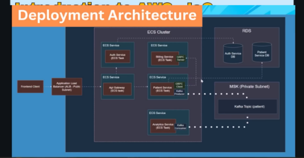

# 🏥 Patient Management System — Microservices Architecture



A modular **microservices-based Patient Management System** built with **Spring Boot**, **Kafka**, **gRPC**, **LocalStack**, and **AWS CDK (bootstrapless)**.
This project follows a clean distributed architecture suitable for large-scale enterprise healthcare platforms.

---

## 🚀 Key Features

### 🧩 Microservices Architecture

Each major domain is split into independent deployable Spring Boot services:

* **Auth Service** — handles authentication & token issuing
* **API Gateway** — unified entry point for REST endpoints
* **Patient Service** — manages patient records & profiles
* **Billing Service** — handles billing, invoices, payments
* **Analytics Service** — consumes Kafka streams for insights
* **gRPC Request Module** — shared compiled gRPC stubs
* **API Request Module** — shared DTOs for REST
* **Integration Tests Module** — contract + workflow tests
* **Infrastructure** — LocalStack, CDK, deployment automation

---

## ⚡ Communication Between Services

### 🔄 Kafka (Event Streaming)

* Patient events
* Billing events
* Visit/consultation events
* Analytics service consumes all major topics

### ⚡ gRPC (Inter-Service)

* Used for high-performance internal RPC
* Shared `.proto` definitions stored in `grpc-request/`
* Maven plugin auto-generates Java stubs

### 🌐 REST (External API)

* All external traffic passes through **API Gateway**

---

## ☁️ Cloud Simulation With LocalStack

LocalStack emulates AWS services locally:

| AWS Service       | Used For                      |
| ----------------- | ----------------------------- |
| S3                | Storage of test patient files |
| API Gateway / ELB | Routing traffic               |
| CloudFormation    | Provisioning via CDK          |
| IAM               | Mocked roles & policies       |
| SNS/SQS           | Optional messaging            |

Infrastructure is deployed using:

```
infrastructure/localstack-deploy.sh
```

---

## 📁 Folder Structure

```
patient-management/
│── analytics-service/       # Kafka analytics consumer
│── api-gateway/             # Spring Cloud Gateway
│── api-request/             # Shared REST DTOs
│── auth-service/            # Authentication + JWT issuance
│── billing-service/         # Billing & invoice microservice
│── grpc-request/            # Shared gRPC proto + generated stubs
│── infrastructure/          # LocalStack + CDK deployment
│── integration-tests/       # Contract & integration testing
│── patient-service/         # Patient profile domain service
│── app-architecture.png     # Architecture diagram (referenced in README)
└── pom.xml                  # Multi-module Maven configuration
```

---

## 🛠️ Running the System

### 1️⃣ Start Docker Services (Kafka + LocalStack + Microservices)

```bash
docker-compose up -d
```

### 2️⃣ Deploy infrastructure into LocalStack

```bash
cd infrastructure
./localstack-deploy.sh
```

### 3️⃣ Get the local load balancer endpoint

```bash
aws --endpoint-url=http://localhost:4566 elbv2 describe-load-balancers \
  --query "LoadBalancers[0].DNSName" --output text
```

### 4️⃣ Test API Gateway

```bash
curl http://localhost:4004/auth/login
```

---

## 🧪 Development

### Build all modules

```bash
mvn clean install
```

### Run individual service

```bash
cd patient-service
mvn spring-boot:run
```

### Regenerate gRPC stubs

```bash
mvn protobuf:compile
```

---

## 📦 Technologies Used

* **Spring Boot 3 / Java 21**
* **Kafka (Bitnami or Confluent)**
* **LocalStack**
* **AWS CDK (Bootstrapless Synthesizer)**
* **Docker + Docker Compose**
* **gRPC + Protocol Buffers**
* **PostgreSQL / MySQL**
* **JUnit + Testcontainers**

---

## 📜 License

MIT — free to use and modify.

---

